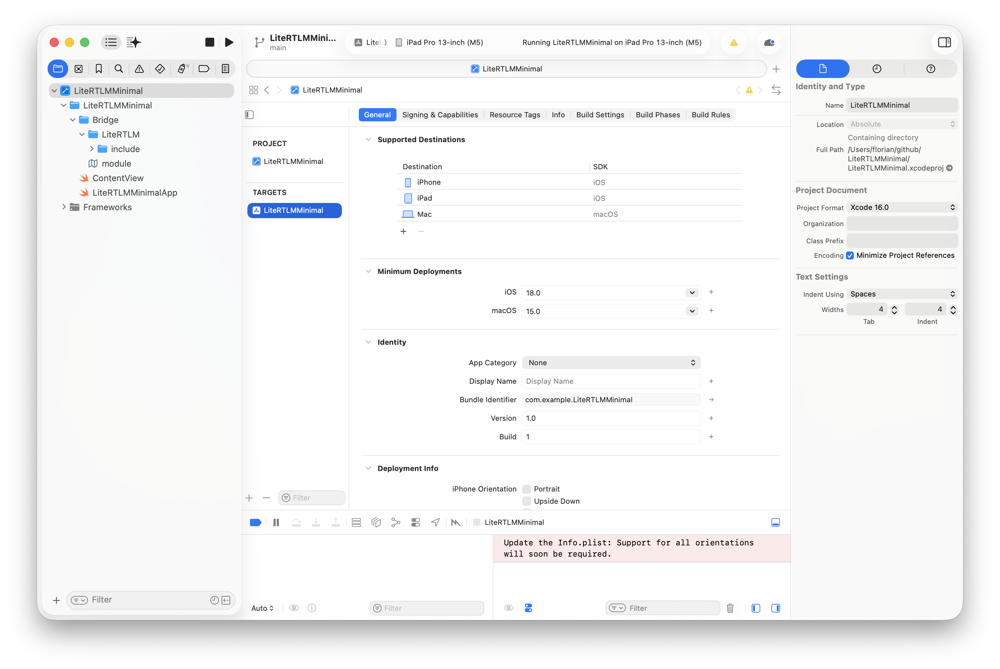
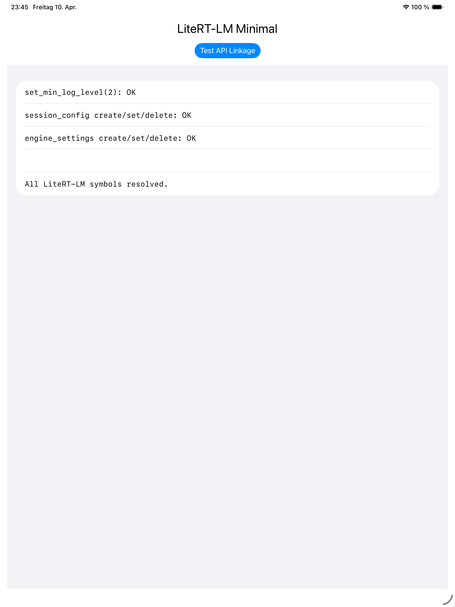

# LiteRTLMMinimal

Minimal SwiftUI app demonstrating [LiteRT-LM](https://github.com/google-ai-edge/LiteRT-LM) xcframework integration on macOS and iOS.

The app calls model-free C API functions (`session_config`, `engine_settings`, `set_min_log_level`) to prove that all LiteRT-LM symbols resolve correctly at link time — no model file required.





## Prerequisites

- Xcode 16.2+
- [Bazel](https://bazel.build/) (only if building `libc_engine.a` from source)
- Git LFS (for pulling prebuilt dylibs from the LiteRT-LM submodule)

## Setup

```bash
git clone --recurse-submodules git@github.com:scriptease/LiteRTLMMinimal.git
cd LiteRTLMMinimal
```

If you already cloned without `--recurse-submodules`:

```bash
git submodule update --init
```

### Build the xcframeworks

#### 1. Build static libraries and pull prebuilt dylibs

```bash
scripts/build-litert-macos.sh all
```

This builds `libc_engine.a` via Bazel for three platform slices (`macos_arm64`, `ios_arm64`, `ios_sim_arm64`) and pulls the prebuilt `libGemmaModelConstraintProvider.dylib` for each platform via Git LFS. Output goes to `build/lib/`.

#### 2. Create xcframeworks

```bash
scripts/create-litert-xcframeworks.sh
```

This produces two xcframeworks in `build/xcframeworks/`:

| xcframework | Type | Size | Embed |
|---|---|---|---|
| `LiteRTLM.xcframework` | Static (`libc_engine.a` + `engine.h` + module map) | 321 MB | Do Not Embed |
| `GemmaModelConstraintProvider.xcframework` | Dynamic (`libGemmaModelConstraintProvider.dylib`) | 48 MB | Embed & Sign |

Each xcframework contains three platform slices: `ios-arm64`, `ios-arm64-simulator`, `macos-arm64`.

The script checks all artifacts exist, prepares headers with a Clang module map, fixes dylib install names to `@rpath/`, and calls `xcodebuild -create-xcframework` twice.

### Open and run

```bash
open LiteRTLMMinimal.xcodeproj
```

Select a destination (My Mac, iPhone simulator, or iPad simulator) and build. Tap **Test API Linkage** to verify all symbols resolve.

## Project structure

```
LiteRTLMMinimal/
├── LiteRT-LM/                              # git submodule
├── LiteRTLMMinimal.xcodeproj/
├── LiteRTLMMinimal/
│   ├── LiteRTLMMinimalApp.swift            # @main entry point
│   ├── ContentView.swift                   # API linkage test UI
│   └── Bridge/
│       ├── module.modulemap                # exposes C API to Swift
│       └── LiteRTLM/include/
│           └── engine.h → LiteRT-LM/c/    # symlink into submodule
├── scripts/
│   ├── build-litert-macos.sh               # Bazel build → build/lib/
│   └── create-litert-xcframeworks.sh       # lib/ → build/xcframeworks/
└── build/                                  # .gitignored
    ├── lib/{macos_arm64,ios_arm64,ios_sim_arm64}/
    └── xcframeworks/
```

## How it links

The Xcode project uses SDK-conditioned linker flags to force-load the correct static library slice:

```
OTHER_LDFLAGS[sdk=iphoneos*]       = -lc++ -Wl,-force_load,$(SRCROOT)/build/xcframeworks/LiteRTLM.xcframework/ios-arm64/libc_engine.a
OTHER_LDFLAGS[sdk=iphonesimulator*] = -lc++ -Wl,-force_load,$(SRCROOT)/build/xcframeworks/LiteRTLM.xcframework/ios-arm64-simulator/libc_engine.a
OTHER_LDFLAGS[sdk=macosx*]         = -lc++ -Wl,-force_load,$(SRCROOT)/build/xcframeworks/LiteRTLM.xcframework/macos-arm64/libc_engine.a
```

iOS builds also link `-framework AVFAudio -framework AudioToolbox` (required by miniaudio in `libc_engine.a`).

The dynamic `GemmaModelConstraintProvider.xcframework` is linked normally and embedded with code signing.

The C API is exposed to Swift via a Clang module map at `LiteRTLMMinimal/Bridge/module.modulemap`, found by the compiler through `SWIFT_INCLUDE_PATHS`.

## License

The LiteRT-LM submodule is licensed under the [Apache License 2.0](https://github.com/google-ai-edge/LiteRT-LM/blob/main/LICENSE).
